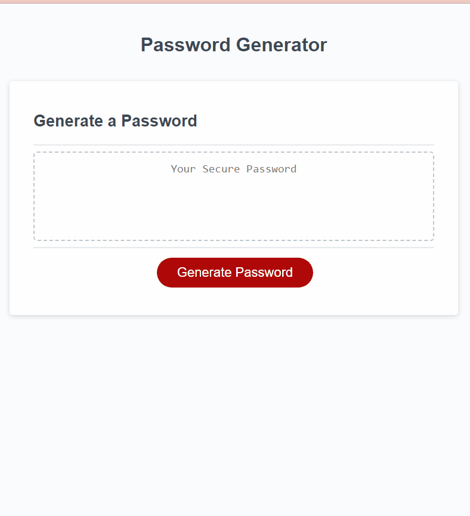

# Password Generator

## Technology Used 

| Technology Used         | Resource URL           | 
| ------------- |:-------------:|  
| Git | [https://git-scm.com/](https://git-scm.com/)     | 
| JavaScript | [https://developer.mozilla.org/en-US/docs/Web/JavaScript](https://developer.mozilla.org/en-US/docs/Web/JavaScript)   
|            |  [https://www.w3schools.com/js/default.asp](https://www.w3schools.com/js/default.asp) 
|            |  [https://stackoverflow.com/](https://stackoverflow.com/)  |

## Description 

[Visit the Deployed Site](https://beckamcnally.github.io/password-generator/)

The JavaScript: Password Generator is an application that generates a random and secure password based on criteria specified by the user. The application presents a series of prompts to the user, asking for password length and character types such as uppercase, lowercase, numeric, and special characters. After validating the user input, the application generates a password that matches the selected criteria and displays it on the page.

## Table of Contents 

* [Usage](#usage)
* [Learning Points](#learning-points)
* [Author Info](#author-info)
* [Credits](#credits)
* [License](#license)

## Usage
To use the Password Generator application, [visit the Deployed Site](https://beckamcnally.github.io/password-generator/). Click the "Generate Password" button to start the password generation process. Follow the prompts and select the desired criteria for your password. Once all prompts are answered, the application will generate a password that matches the selected criteria and display it on the page.

## Learning Points 

DOM manipulation using JavaScript.
Functions and conditional statements in JavaScript.
Generating a random password in JavaScript.
Input validation using JavaScript.
Event listeners in JavaScript.

## Author Info

### Becka McNally 

* [Portfolio](https://beckamcnally.github.io/beckamcnally/)
* [LinkedIn](https://www.linkedin.com/in/becka-mcnally-21520670/)
* [Github](https://github.com/beckamcnally)

## Credits

Jasmine Ulloa [Github](https://github.com/silkyjazz) - Thank you for Psedocoding with me and working through the tough parts!

